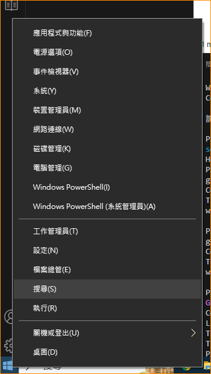
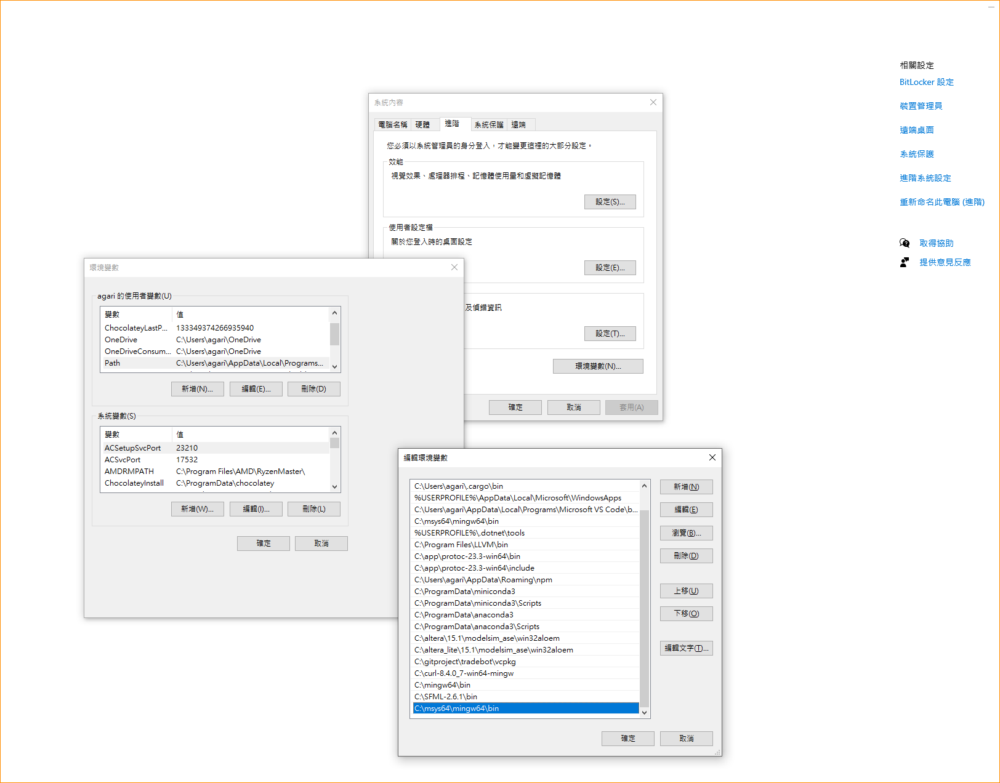

# Tic-Tac-Toe
oop final project

# quick start
[git](https://git-scm.com/)  
[VSCODEE](https://code.visualstudio.com/)  
[MSYS2](https://www.msys2.org/)

```shell
pacman -Syu
pacman -Sy
pacman -S mingw-w64-x86_64-toolchain
pacman -S mingw-w64-x86_64-sfml
pacman -Sy
pacman -Syu
```

加入系統變數  
對windows右鍵

選擇系統(Y)

右方藍字進階系統->環境變數(N)->使用者的使用者變數->往下拉一點，雙擊Path->新增(N)->輸入C:\msys64\mingw64\bin->確定->確定->套用->確定

重開機
看看有沒有成功安裝

```shell
gcc --version
g++ --version
gdb --version
```

VScode插件
code running
c++

設置 .vscode 資料夾

.vscode.sample把.sample去掉
檢查環境是否可用，不可用就除錯


參考
https://blog.roy4801.tw/2020/07/14/SFML/sfml_intro/  


